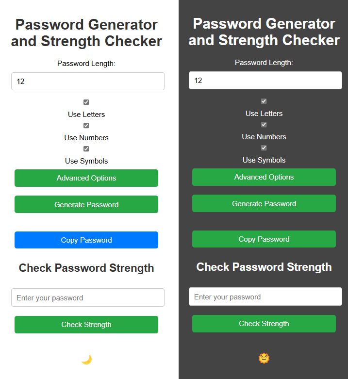

# Password Generator and Strength Checker

## 📌 Overview
This is a simple and customizable Password Generator and Strength Checker. It allows users to generate strong passwords with specific settings (such as including letters, numbers, and symbols), check the strength of a password, and toggle between light and dark modes.

## ✨ Features

- ✅ **Password Generation**: Generate random passwords with customizable settings (length, use of letters, numbers, and symbols).
- ✅ **Password Strength Check**: Check the strength of any password entered by the user.
- ✅ **Dark Mode**: Toggle between light and dark modes with a button.
- ✅ **Advanced Options**: Customize allowed letters, numbers, and symbols for password generation.

## 💡 How to Use

1. **Set Password Length**: Select the desired length of the password.
2. **Choose Character Types**: Check the boxes to include letters, numbers, or symbols.
3. **Advanced Options**: Click the "Advanced Options" button to customize the allowed characters for letters, numbers, and symbols.
4. **Generate Password**: Click the "Generate Password" button to create a password.
5. **Password Strength**: The strength of the generated password is displayed below the password.
6. **Copy Password**: Use the "Copy Password" button to copy the generated password to the clipboard.
7. **Password Strength Checker**: Enter a password in the "Check Password Strength" field and click the button to check its strength.

## 🌙 Dark Mode

- You can toggle between light and dark mode by clicking the 🌙 (moon) icon. When dark mode is active, the icon will change to 🌞 (sun).

## 📥 Local Storage

The settings you choose (password length, and whether to include letters, numbers, or symbols) are saved in the browser's local storage, so the settings persist when you reload the page.

## 🛠️ Installation

To use this project locally, follow these steps:

1. Clone this repository:

```bash
git clone https://github.com/yourusername/password-generator.git
```

## 📝 License
This project is licensed under the **MIT License**.

## 📩 Contact
For any questions or suggestions, reach out via **liordaichman@gmail.com** or open an issue on GitHub.

## 📷 Screenshot

